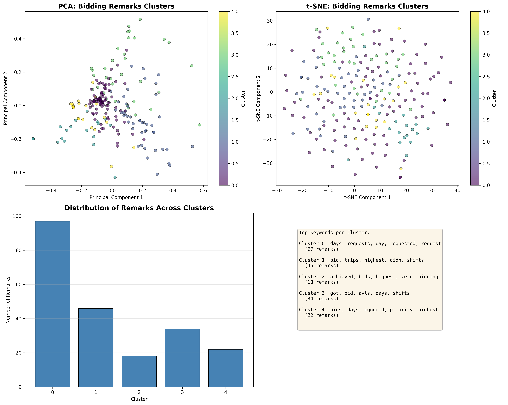

# Bidding Remarks Clustering

A text clustering analysis tool that automatically groups roster bidding survey remarks using TF-IDF vectorization and K-Means clustering. This helps identify common themes and patterns in employee feedback.

## Overview

This project processes free-text bidding remarks from roster bidding surveys and clusters them into meaningful groups using natural language processing techniques. It's useful for:

- Identifying common themes in employee feedback
- Understanding patterns in roster preferences
- Grouping similar concerns or requests
- Facilitating faster review of large volumes of text responses

## Features

- TF-IDF text vectorization for feature extraction
- K-Means clustering to group similar remarks
- Multiple visualization techniques (PCA, t-SNE)
- Cluster distribution analysis
- Top keyword extraction per cluster

## Project Structure

```
bidding-remarks-clustering/
├── cluster_remarks.py          # Main clustering script
├── visualize_clusters.py       # Visualization script
├── data_bidding_remarks.csv    # Input data (not tracked)
├── clustered_bidding_remarks.csv  # Output with cluster labels
├── cluster_visualization.png   # Generated visualization
└── README.md                   # This file
```

## Requirements

```bash
pip install pandas scikit-learn matplotlib seaborn
```

Or install from requirements file:

```bash
pip install -r requirements.txt
```

## Usage

### 1. Prepare Your Data

Ensure your CSV file (`data_bidding_remarks.csv`) has a column named `Bidding Remarks` containing the text data.

### 2. Run Clustering

```bash
python cluster_remarks.py
```

This will:
- Load and preprocess the remarks
- Convert text to TF-IDF features
- Apply K-Means clustering (default: 5 clusters)
- Save results to `clustered_bidding_remarks.csv`

### 3. Visualize Results

```bash
python visualize_clusters.py
```

This generates:
- PCA 2D projection of clusters
- t-SNE 2D projection of clusters
- Cluster distribution bar chart
- Top keywords for each cluster
- Saved visualization: `cluster_visualization.png`

## Customization

### Adjusting Number of Clusters

Edit `cluster_remarks.py`:

```python
num_clusters = 5  # Change this value
```

### Modifying TF-IDF Parameters

```python
tfidf_vectorizer = TfidfVectorizer(
    stop_words='english',
    max_features=500,  # Maximum number of features
    min_df=2,          # Minimum document frequency
    max_df=0.8         # Maximum document frequency
)
```

## Output

**clustered_bidding_remarks.csv**: Original data with an additional `Cluster` column containing cluster assignments (0 to n-1).

**cluster_visualization.png**: Four-panel visualization showing cluster distributions and projections.

## Visualizations



The visualization provides four key insights:

1. **PCA Projection (Top Left)**: Shows global structure of clusters in 2D space. Well-separated clusters indicate distinct themes in the remarks.

2. **t-SNE Projection (Top Right)**: Reveals local patterns and fine-grained groupings. Better at showing tight clusters that might overlap in PCA.

3. **Cluster Distribution (Bottom Left)**: Bar chart showing how remarks are distributed across clusters. Helps identify if clusters are balanced or if some are catch-all groups.

4. **Top Keywords (Bottom Right)**: Lists the most important keywords for each cluster, helping you understand what theme each cluster represents.

## How It Works

1. **Preprocessing**: Text is converted to lowercase for consistency
2. **Vectorization**: TF-IDF (Term Frequency-Inverse Document Frequency) converts text into numerical features
3. **Clustering**: K-Means algorithm groups similar remarks based on their TF-IDF vectors
4. **Visualization**: Dimensionality reduction (PCA/t-SNE) projects high-dimensional data into 2D for visualization

## Example Output

```
Cluster 0: schedule, flexibility, prefer, work, days (45 remarks)
Cluster 1: weekend, shift, avoid, family, time (38 remarks)
Cluster 2: training, development, opportunity, learn, skill (29 remarks)
...
```

## License

This project is for personal use.

## Contributing

This is a personal project, but suggestions and improvements are welcome!